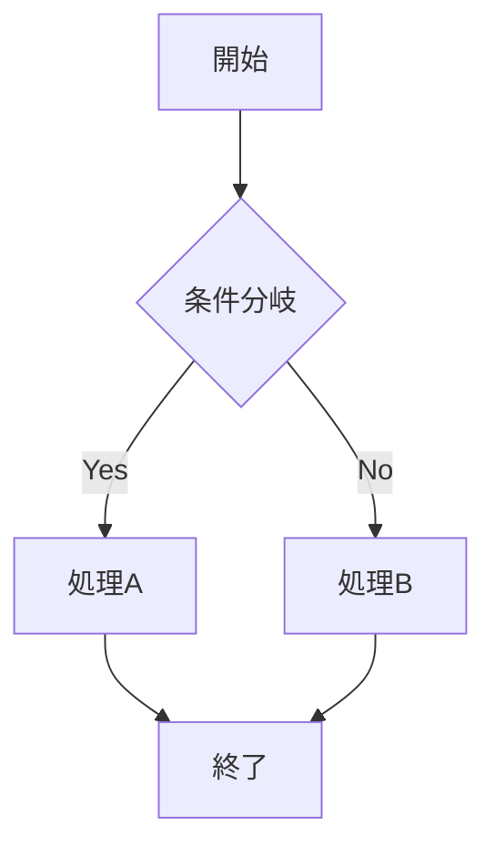

# Markdown to PDF Converter

GUIを備えたMarkdownからPDFへの変換ツールです。複数ファイルの一括変換、Mermaidダイアグラムのサポート、カスタム改ページ、ドラッグ&ドロップ対応など、使いやすい機能を提供します。

## 特徴

- 🖱️ **直感的なGUI** - ドラッグ&ドロップ対応の使いやすいインターフェース
- 📁 **複数ファイル対応** - 複数のMarkdownファイルを一度に選択して一括変換
- 🗑️ **個別ファイル管理** - ファイルリストから個別にファイルを削除可能
- 📊 **Mermaidサポート** - フローチャートやダイアグラムを含むMarkdownを正確に変換
- 📄 **改ページ制御** - カスタマイズ可能な改ページマーカー
- 📑 **目次生成** - 自動的に目次を生成（オプション）
- 🎨 **プレビュー機能** - 変換前にHTMLプレビューを確認、ズーム機能付き
- ⚙️ **上書き確認** - 既存ファイルの上書き時に確認ダイアログ表示
- 🎯 **プロフェッショナルUI** - 洗練されたモダンなインターフェース
- 📦 **ポータブル版** - インストール不要の単一実行ファイル

## セットアップ

### 開発環境での実行

1. **必要な環境**
   - Python 3.8以上
   - Windows/macOS/Linux

2. **依存パッケージのインストール**
   ```bash
   pip install -r requirements.txt
   ```

3. **アプリケーションの起動**
   ```bash
   python main.py
   ```

### Windows exe版のビルド（PyInstaller使用）

1. **PyInstallerのインストール**
   ```bash
   pip install pyinstaller
   ```

2. **ビルドの実行**
   ```bash
   python build.py
   ```

3. **成果物**
   - `dist/` フォルダに実行可能ファイルが生成されます

<!-- pagebreak -->

## 使い方

### 基本的な使い方

1. アプリケーションを起動
2. Markdownファイルを以下のいずれかの方法で読み込み：
   - ウィンドウにドラッグ&ドロップ
   - 「📁 ファイルを選択」ボタンをクリックして選択（複数選択可能）
3. 出力フォルダを指定
4. 必要に応じて変換オプションを調整
5. 「PDFに変換」ボタンをクリック

### 複数ファイルの管理

- **複数選択**: ファイル選択ダイアログで複数のMarkdownファイルを一度に選択
- **個別削除**: 各ファイル名横の「×」ボタンで個別にファイルを削除
- **一括クリア**: 「🗑 クリア」ボタンですべてのファイルを削除
- **ファイル切り替え**: ファイルリストをクリックまたはプレビューの「◀」「▶」ボタンでファイル間を移動

### プレビュー機能

- **ズーム**: 「🔍-」「🔍+」ボタンで30%〜300%の範囲でズーム調整
- **ファイル切り替え**: 「◀」「▶」ボタンで前後のファイルに移動
- **ページ表示**: 現在のファイル番号/総ファイル数を表示

### 改ページの挿入

Markdownファイル内の改ページしたい位置に以下のマーカーを挿入：

```markdown
<!-- pagebreak -->
```

カスタムマーカーも設定可能です（例：`---newpage---`）。

### Mermaidダイアグラムの使用

コードブロックで`mermaid`を指定：

````markdown

````

### サポートされるMermaidダイアグラム

- フローチャート（graph）
- シーケンス図（sequenceDiagram）
- ガントチャート（gantt）
- 円グラフ（pie）
- ER図（erDiagram）
- ステート図（stateDiagram）
- その他

<!-- pagebreak -->

## 技術仕様

### 使用ライブラリ

- **PyQt5** - GUIフレームワーク
- **PyQtWebEngine** - HTMLレンダリングとPDF生成
- **Markdown** - Markdown処理
- **Pygments** - コードシンタックスハイライト
- **Mermaid.js** - ダイアグラム生成（CDN経由）

### アーキテクチャ

1. **Markdown → HTML変換**
   - Python-Markdownで基本的な変換
   - 拡張機能でテーブル、コードブロック、目次などをサポート

2. **Mermaid処理**
   - HTMLにMermaid.jsを埋め込み
   - WebEngineでJavaScriptを実行してダイアグラムを生成

3. **PDF生成**
   - QtWebEngineのPDF印刷機能を使用
   - 高品質なベクター形式で出力

4. **UI設計**
   - 左右分割レイアウト（設定エリア/プレビューエリア）
   - カスタムファイルアイテムによる柔軟なファイル管理
   - レスポンシブなプレビューエリア

## トラブルシューティング

### Windows Defenderの警告
exe版実行時に警告が出る場合：
1. 「詳細情報」をクリック
2. 「実行」をクリック

### Mermaidが表示されない
- インターネット接続を確認（CDNからMermaid.jsを読み込むため）
- コードブロックの言語指定が`mermaid`になっているか確認

### 日本語の文字化け
- Markdownファイルの文字コードがUTF-8であることを確認
- フォントの問題の場合は、システムフォントを確認

### 変換エラーが発生する場合
- 複数ファイル変換時は、エラーが発生したファイルをスキップして処理を継続
- 変換完了時にエラーレポートを表示
- ファイルパスに特殊文字が含まれていないか確認

## 制限事項

- **外部画像** - ローカル画像のみサポート（Web上の画像は要インターネット接続）
- **CSS** - カスタムCSSは現在サポートされていません
- **PDF設定** - ページサイズはA4固定（今後拡張予定）

## ライセンス

このプロジェクトはMITライセンスの下で公開されています。

## 貢献

バグ報告や機能提案は、GitHubのIssuesまでお願いします。

## 今後の予定

- [ ] ページサイズの選択機能
- [ ] カスタムCSSサポート
- [ ] テーマ選択機能
- [ ] 画像の最適化オプション
- [ ] 出力ファイル名のカスタマイズ
- [ ] 変換進捗の詳細表示
- [ ] プレビューの真のページ分割表示