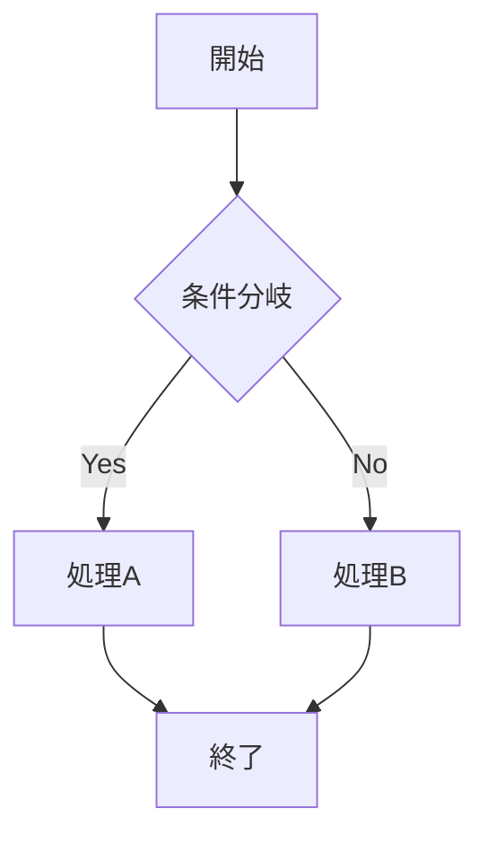

# Markdown to PDF Converter

GUIを備えたMarkdownからPDFへの変換ツールです。統合エディタ、リアルタイムプレビュー、複数ファイルの一括変換など、効率的なMarkdown編集・変換環境を提供します。

## 特徴

- 🖱️ **直感的なGUI** - ドラッグ&ドロップ対応の使いやすいインターフェース
- ✏️ **統合Markdownエディタ** - リアルタイムプレビュー付きの高機能エディタ
- 📝 **新規作成機能** - テンプレート付きの新しいMarkdownファイルを即座に作成
- 📁 **複数ファイル対応** - 複数のMarkdown/テキストファイルを一度に選択して一括変換
- 🗑️ **個別ファイル管理** - ファイルリストから個別にファイルを削除可能
- 📊 **Mermaidサポート** - フローチャートやダイアグラムを含むMarkdownを正確に変換
- 📄 **改ページ制御** - カスタマイズ可能な改ページマーカー
- 📑 **目次生成** - 自動的に目次を生成（オプション）
- 🎨 **3分割レイアウト** - 設定・エディタ・プレビューの効率的な画面構成
- 💾 **インテリジェント保存** - 一時ファイルの管理と自動ファイル名提案
- ⚙️ **上書き確認** - 既存ファイルの上書き時に確認ダイアログ表示
- 🎯 **プロフェッショナルUI** - 洗練されたモダンなインターフェース
- 📦 **ポータブル版** - インストール不要の単一実行ファイル

## セットアップ

### 開発環境での実行

1. **必要な環境**
   - Python 3.8以上
   - Windows/macOS/Linux

2. **依存パッケージのインストール**
   ```bash
   pip install -r requirements.txt
   ```

3. **アプリケーションの起動**
   ```bash
   python MD2PDF.py
   ```

### Windows exe版のビルド（PyInstaller使用）

1. **PyInstallerのインストール**
   ```bash
   pip install pyinstaller
   ```

2. **ビルドの実行**
   ```bash
   pyinstaller MD2PDF.spec
   ```

3. **成果物**
   - `dist/` フォルダに実行可能ファイルが生成されます

<!-- pagebreak -->

## 使い方

### 基本的な使い方

1. **アプリケーションを起動**
2. **ファイルの読み込み**（以下のいずれかの方法）：
   - ウィンドウにMarkdown/テキストファイルをドラッグ&ドロップ
   - 「📁 ファイル選択」ボタンをクリックして選択（複数選択可能）
   - 「📝 新規作成」ボタンで新しいMarkdownファイルを作成
3. **編集**：中央のエディタでMarkdownを編集（リアルタイムプレビュー更新）
4. **保存**：💾ボタンで編集内容を保存
5. **変換**：出力フォルダを指定し、「PDFに変換」ボタンをクリック

### 新規作成機能

1. 「📝 新規作成」ボタンをクリック
2. ファイル名を入力（重複時は自動的に番号付け：「ドキュメント 2」など）
3. テンプレート付きのMarkdownファイルが作成され、即座に編集開始
4. 💾ボタンで名前を付けて保存

### Markdownエディタ

- **リアルタイムプレビュー**：編集内容が右側のプレビューに即座に反映
- **保存機能**：💾ボタンで編集内容を保存
- **再読込機能**：🔄ボタンでファイルを再読込（編集内容破棄の確認付き）
- **構文ハイライト**：Markdownの構文を見やすく表示
- **一時ファイル管理**：新規作成ファイルは自動的に一時ファイルとして管理

### 複数ファイルの管理

- **複数選択**：ファイル選択ダイアログで複数のMarkdown/テキストファイルを一度に選択
- **個別削除**：各ファイル名横の「×」ボタンで個別にファイルを削除
- **一括クリア**：「🗑 クリア」ボタンですべてのファイルを削除
- **ファイル切り替え**：ファイルリストをクリックまたはプレビューの「◀」「▶」ボタンでファイル間を移動
- **テキストファイル対応**：.txtファイルもMarkdownとして読み込み可能

### プレビュー機能

- **ズーム**：「🔍-」「🔍+」ボタンで30%〜300%の範囲でズーム調整
- **ファイル切り替え**：「◀」「▶」ボタンで前後のファイルに移動
- **ページ表示**：現在のファイル番号/総ファイル数を表示
- **リアルタイム更新**：エディタでの変更が即座に反映

### 改ページの挿入

Markdownファイル内の改ページしたい位置に以下のマーカーを挿入：

```markdown
<!-- pagebreak -->
```

カスタムマーカーも設定可能です（例：`---newpage---`）。

### Mermaidダイアグラムの使用

コードブロックで`mermaid`を指定：

````markdown

````

### サポートされるMermaidダイアグラム

- フローチャート（graph）
- シーケンス図（sequenceDiagram）
- ガントチャート（gantt）
- 円グラフ（pie）
- ER図（erDiagram）
- ステート図（stateDiagram）
- その他

<!-- pagebreak -->

## UI構成

### 3分割レイアウト

1. **左パネル（設定エリア）**
   - ファイル操作ボタン（選択・新規作成・クリア）
   - ドラッグ&ドロップエリア
   - ファイルリスト
   - 出力設定
   - 変換オプション
   - 変換ボタン

2. **中央パネル（エディタエリア）**
   - Markdownエディタ
   - 保存・再読込ボタン
   - 編集状態表示

3. **右パネル（プレビューエリア）**
   - HTMLプレビュー
   - ズーム・ページ制御
   - ファイル切り替えボタン

## 技術仕様

### 使用ライブラリ

- **PyQt5** - GUIフレームワーク
- **PyQtWebEngine** - HTMLレンダリングとPDF生成
- **Markdown** - Markdown処理
- **Pygments** - コードシンタックスハイライト
- **Mermaid.js** - ダイアグラム生成（CDN経由）

### アーキテクチャ

1. **Markdown → HTML変換**
   - Python-Markdownで基本的な変換
   - 拡張機能でテーブル、コードブロック、目次などをサポート

2. **リアルタイムプレビュー**
   - エディタの変更をリアルタイムでHTMLに変換
   - WebEngineで即座にプレビュー更新

3. **ファイル管理**
   - 一時ファイルの自動管理
   - Windows風の重複ファイル名処理
   - ファイルパス変更の追跡

4. **PDF生成**
   - QtWebEngineのPDF印刷機能を使用
   - 高品質なベクター形式で出力
   - カラー印刷対応

5. **UI設計**
   - 3分割レイアウト（設定・エディタ・プレビュー）
   - カスタムファイルアイテムによる柔軟なファイル管理
   - レスポンシブなプレビューエリア

## トラブルシューティング

### Windows Defenderの警告
exe版実行時に警告が出る場合：
1. 「詳細情報」をクリック
2. 「実行」をクリック

### Mermaidが表示されない
- インターネット接続を確認（CDNからMermaid.jsを読み込むため）
- コードブロックの言語指定が`mermaid`になっているか確認

### 日本語の文字化け
- Markdownファイルの文字コードがUTF-8であることを確認
- フォントの問題の場合は、システムフォントを確認

### 変換エラーが発生する場合
- 複数ファイル変換時は、エラーが発生したファイルをスキップして処理を継続
- 変換完了時にエラーレポートを表示
- ファイルパスに特殊文字が含まれていないか確認

### エディタの動作が重い場合
- 大きなファイルの場合、リアルタイムプレビューを一時的に無効化
- メモリ使用量を確認

## 制限事項

- **外部画像** - ローカル画像のみサポート（Web上の画像は要インターネット接続）
- **CSS** - カスタムCSSは現在サポートされていません
- **PDF設定** - ページサイズはA4固定（今後拡張予定）
- **大容量ファイル** - 非常に大きなMarkdownファイルではパフォーマンスが低下する可能性

## ライセンス

このプロジェクトはMITライセンスの下で公開されています。

## 貢献

バグ報告や機能提案は、GitHubのIssuesまでお願いします。

## 今後の予定

- [ ] ページサイズの選択機能
- [ ] カスタムCSSサポート
- [ ] テーマ選択機能（ダーク/ライトモード）
- [ ] 画像の最適化オプション
- [ ] 出力ファイル名のカスタマイズ
- [ ] 変換進捗の詳細表示
- [ ] プレビューの真のページ分割表示
- [ ] エディタの機能拡張（検索・置換、行番号表示など）
- [ ] 印刷プレビュー機能
- [ ] 複数言語対応